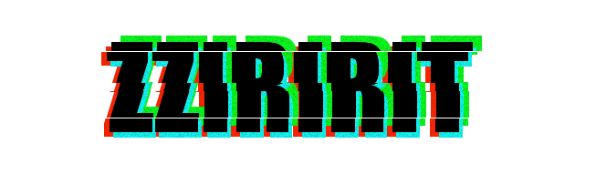

# 🌙 소개

---
찌리릿은 네이버 실시간 스트리밍 플랫폼 '치지직' 스트리머와 시청자를 위한 커뮤니티입니다. 
스트리머의 신청에 따라 본인의 게시판을 신청할 수 있고, 자유롭게 게시판을 커스텀할 수 있습니다.

# 🖥 프로젝트 화면

---

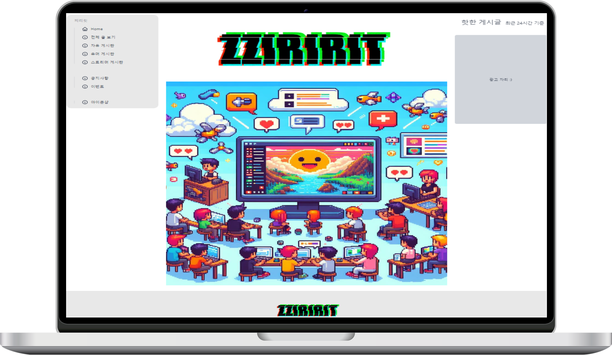

# 📆 프로젝트 개발 기간 및 타임라인

---
2024-02-26 ~ 2024-04-05

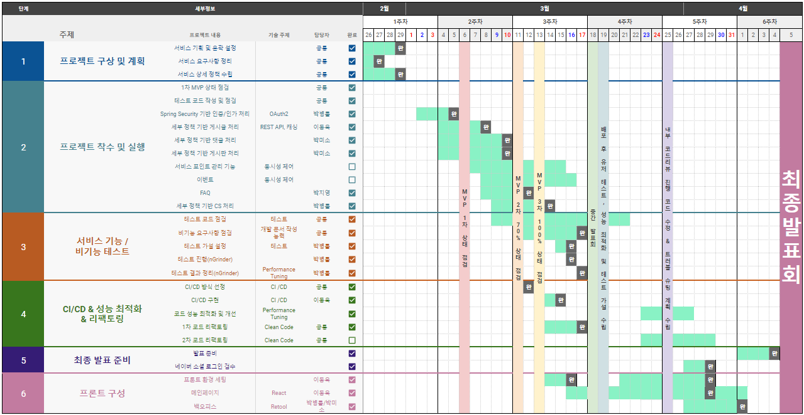

# 🙋🏻‍♂️ 팀 소개

---

|      |  |  |  |  |
|------|-------------------------------------------------------|---------------------------------------------------------|---------------------------------------------------------|----------------------------------------------------------|
| 이름   | 박미소                                                   | 박병률                                                     | 이동욱                                                     | 박지영                                                      |
| GitHub | [miso1105](https://github.com/miso1105)               | [doojoo9999](https://github.com/doojoo9999)             | [moveuk](https://github.com/moveuk)                     | [jiyeong2023](https://github.com/jiyeong2023)            |
| Blog   | [@miso_](https://velog.io/@miso_)                     | [@parkbro](https://velog.io/@parkbro)                   | [dul2](https://dul2.tistory.com/)                       | [liveme-2023](https://liveme-2023.tistory.com/)          |

# 🏝️ 우리 팀은요

---

## 🤝 팀 핵심가치
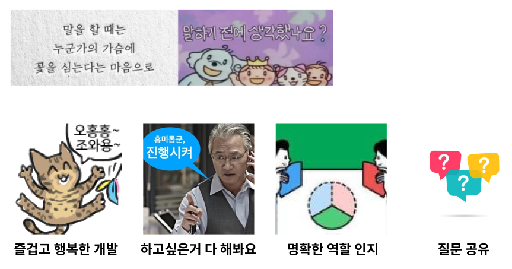

## 😸 팀 문화
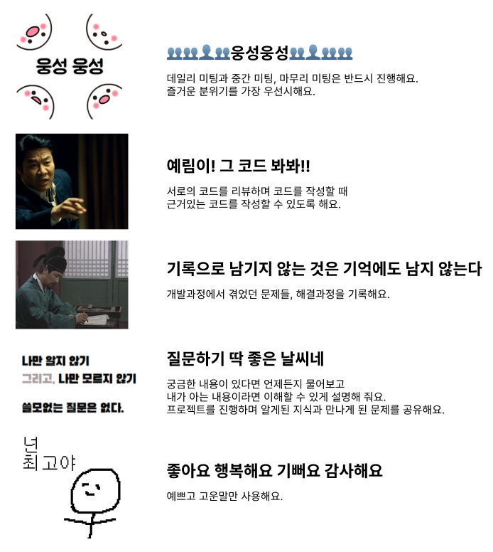

 

# 🐋 Tech Stack

---

### frontend
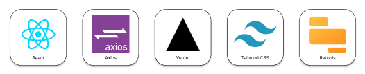

### backend
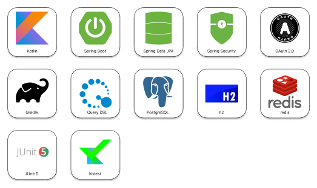

### 협업툴
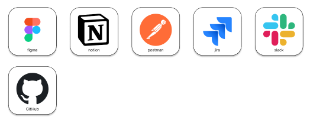

### infra
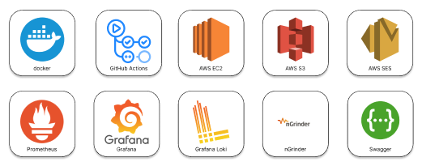

# 🏗️ Infrastructure

---

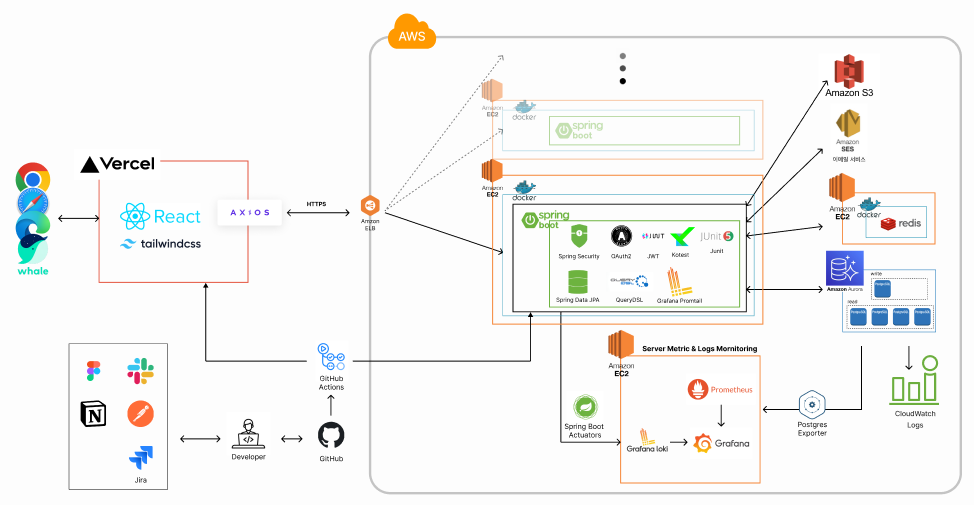

# 🔀 CI/CD Pipeline

---
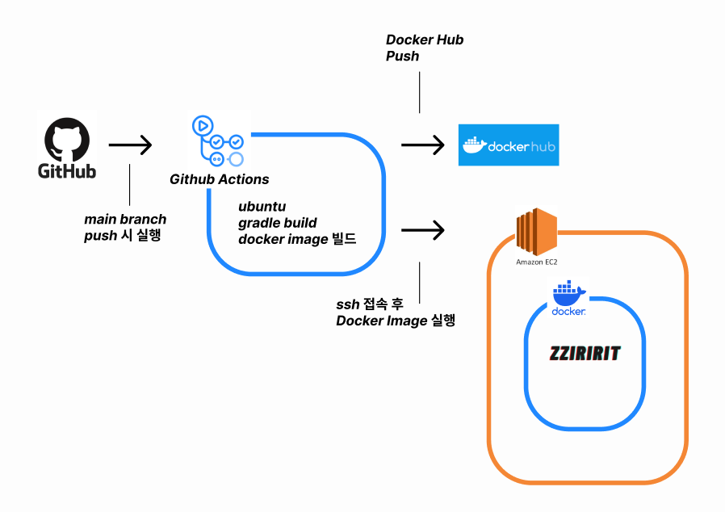

# 💯 Test Code

---

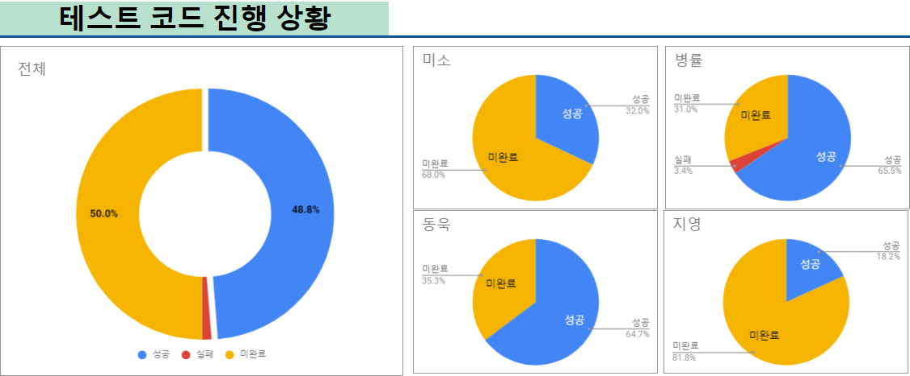
